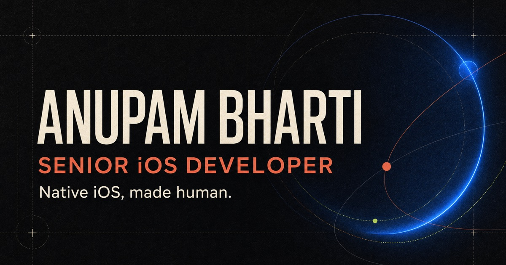
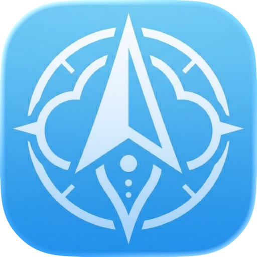

  

  <a href="https://anupambharti.com">Portfolio</a>
  &nbsp;·&nbsp;
  <a href="mailto:anupambhartiab@gmail.com?subject=iOS%20project%20conversation">Email</a>
  &nbsp;·&nbsp;
  <a href="https://apps.apple.com/in/developer/anupam-bharti/id1638887019">App Store</a>

---

## Native craft · Product judgment · Delivery discipline

I turn complex product ideas into calm, capable iPhone experiences.

I have built native iOS products since 2020 through independent releases, consulting engagements and product teams. My work spans offline navigation, accessibility, health, travel, product verification and loyalty—from hands-on engineering and App Store delivery to technical leadership and education.

> I care about the details people feel: sensible navigation, a fast first launch, predictable state, and interfaces that make difficult tasks feel simple.

## Products in the wild

<table>
  <tr>
    <td width="84" valign="top">
      
    </td>
    <td valign="top">
      <h3><a href="https://apps.apple.com/in/app/cloudnav/id6762081293">CloudNav ↗</a></h3>
      
<strong>Independent product · Navigation</strong>

      
A private, offline-first GPS utility for live coordinates, altitude, speed, heading, and saved locations—without accounts or tracking.

      
<code>Offline-first</code> <code>Live GPS</code> <code>Privacy</code>

    </td>
  </tr>
  <tr>
    <td width="84" valign="top">
      
    </td>
    <td valign="top">
      <h3><a href="https://apps.apple.com/in/app/patna-city-guide/id6796055390">Patna: City Guide ↗</a></h3>
      
<strong>Independent product · Travel</strong>

      
A local-first guide with 42 places, curated day plans, Apple Maps, and useful offline access.

      
<code>Apple Maps</code> <code>Offline core</code> <code>No tracking</code>

    </td>
  </tr>
</table>

### Production work

- **Kibo · Accessible reading** — Built iOS workflows across OCR, image classification, object detection, translation, document scanning, PDF reading, and accessibility preferences at Trestle Labs.
- **Acviss · Product delivery** — Led technical delivery, mentored developers, maintained SDK and CocoaPods releases, built QR-decoding features, and supported App Store releases.
- **GUVI · Technical education** — Created structured Swift, Xcode, and iOS app-development material covering debugging, UI, navigation, and memory management.

Other App Store work includes [Certify](https://apps.apple.com/in/app/certify-by-acviss/id1519576615), [K-ONN Rewards](https://apps.apple.com/in/app/k-onn-rewards/id1373673295), [The CarePal](https://apps.apple.com/in/app/the-carepal/id6745544405), and [UpTodd](https://apps.apple.com/in/app/uptodd-parenting-baby-food/id1558333792).

## Engineering toolkit

**Native iOS:** `Swift` · `SwiftUI` · `UIKit` · `Core Data` · `Xcode`

**Camera and intelligent workflows:** `VisionKit` · `ML Kit` · `OCR` · `Camera APIs` · `Firebase ML`

**Delivery and collaboration:** `App Store Connect` · `TestFlight` · `CocoaPods` · `Git` · `Agile`

## Experience in brief

- **GUVI · iOS Technical Author, Nov 2024–Mar 2026** — Turned complex iOS concepts into practical learning paths.
- **Acviss · iOS Developer / Technical Manager, May 2021–Jul 2022** — Combined hands-on engineering with team, client, and release leadership.
- **Trestle Labs · iOS Developer, Jun 2020–May 2021** — Built inclusive reading and document experiences for Kibo.

---

  <strong>Have an iOS problem worth solving?</strong> 
  <a href="mailto:anupambhartiab@gmail.com?subject=iOS%20project%20conversation">anupambhartiab@gmail.com</a>
  &nbsp;·&nbsp;
  <a href="https://anupambharti.com">anupambharti.com</a>

